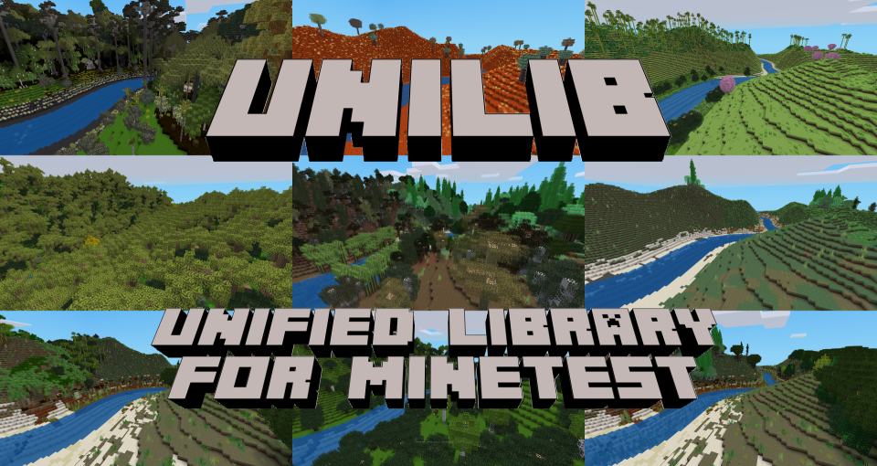

# unilib - the Unified Library for Minetest!

## Downloads: click [here](https://github.com/axcore/unigame)

- Material from over 200 [Minetest](https://www.minetest.net/) mods, reorganised as a single mod
- **unilib** focuses on natural landscapes - there are no mobs, no armour, no industrialisation, and few weapons
- Due to the magic of Minetest aliases, **unilib** should be compatible with most other mods

## unilib runs with anything

- **unilib** has no hard dependencies; it will run on top of any game
- If you don't want to run **unilib** on top of [minetest_game](https://github.com/minetest/minetest_game), then you can try [unigame](https://github.com/axcore/unigame)
- unigame is a minimal base game, with only essential functionality (most API functions, player physics, a basic inventory mod, and so on)
- But, unigame includes a copy of **unilib** - so it's a fully-featured voxel experience, ready to play!

## Create your own world

- You can easily create the world of your dreams - no coding skills required!
- Code has been divided into the smallest possible components, called *packages*
- Each package contains closely-related material, for example stone and cobblestone share a package
- But sand has a package of its own
- A *remix* is a list of packages
- **unilib** provides a large selection of remixes, ready for use (see the screenshot above!)
- If you can open a text editor and write a list of packages, then you can create your own remix!

## This is an ALPHA release

- It is fully playable, but future releases may introduce game-breaking changes. <u>Don't invest a lot of time and energy into your game</u> unless you are willing to maintain the code yourself
- **unilib** is highly configurable. It's worth reading the whole of this text
- Minetest v5.4.1 (or later) is recommended

# Remixes

The default remix is called **playme**. It provides a great many trees, plants, crops, biomes, stones, metals and minerals. However, it does not provide *all* of those items - that's where you come in!

The first step is to choose the remixes you want. You can do this in Minetest settings.

- In the Minetest menu, click the **Settings** tab
- Then click the **All settings** button at the bottom
- Click on **Content: Mods** to expand it
- Then click on **Unified Library for Minetest** to expand it
- Double click the line **Remixes**
- Enter one or more remix names, e.g. **mtgame bonemeal**

You can also modify the **unilib** code, if you prefer.

- Open the file **settingtypes.txt**, and modify the **playme** value near the top
- Alternatively, open the file **../lib/system/override.lua**
- Scroll down to the line containing **unilib.remix_set**
- Uncomment the line by removing the first two characters
- Then modify the **playme** value, preserving the double quotes, for example **unilib.remix_set = "mtgame bonemeal"**

You can specify as many different remixes as you like. 

## Base remixes

**unilib** provides nearly a hundred different remixes. Many of them correspond to another mod; for example the **bonemeal** remix contains everything from the [bonemeal mod](https://notabug.org/tenplus1/bonemeal).

The **mtgame** contains nearly everything from the Minetest's default game, [minetest_game](https://github.com/minetest/minetest_game), including its biomes, decorations and ores. If you don't want those things, then you can use the **mtgame_mini** remix, which contains nearly everything *except* the biomes, decorations and ores. Those things are themselves available in their own remixes, **mtgame_biomes**, **mtgame_decos** and **mtgame_ores**. The **default** remix contains nearly everything from minetest_game's **default** mod.

Additional remixes provide their own collections of biomes, decorations and ores. They should usually be used together with the **mtgame_mini** remix.

- **ethereal** provides everything from the colourful [ethereal-ng](https://notabug.org/tenplus1/ethereal) mod
- **australia** provides everything from the [australia](https://content.minetest.net/packages/demon_boy/australia/) mod 
- **aotearoa** provides everything from the New Zealand-themed mod, [aotearoa](https://content.minetest.net/packages/Eris/aotearoa/)

If you want items from those mods, but without the biomes, decorations and ores, then the remixes **ethereal_mini**, **australia_mini** and **aotearoa_mini** are available.

**unilib** provides a number of remixes corresponding to the mods named, at one time or another, [GAL](https://github.com/ShadMOrdre/GAL_Game), [lib_ecology](https://github.com/ShadMOrdre/lib_ecology) and [lib_materials](https://github.com/ShadMOrdre/lib_materials). These are collectively described as **GLEM**. Again, they should be used together with the **mtgame_remix** (but not with each other).

- **glemr4** is revision 4 (uploaded 12 December 2018)
- **glemr6** is revision 6 (uploaded 19th Apr 2019)
- **glemr11** is revision 11 (uploaded 31st Aug 2019)

## Other remixes

Some other popular remixes include:

- **bonemeal** from the [bonemeal](https://notabug.org/tenplus1/bonemeal) mod, which should work with all **unilib** trees, plants, grasses, crops, produce and flowers
- **basic_materials** from the [Basic Materials and Items](https://content.minetest.net/packages/mt-mods/basic_materials/) mod, which provides the raw components used by mods such as [technic](https://github.com/minetest-mods/technic)
- **farming_redo** from the [Farming Redo](https://content.minetest.net/packages/TenPlus1/farming/) mod, which provides a selection of crops and vegetables
- **minimal**, which provides the bare minimum number of items (stone and water) to create a Minetest world
- **technic** from the [technic](https://github.com/minetest-mods/technic) mod, which provides only the raw materials provided by that mod (but no technology)
- **towercrane** from the [Tower Crane](https://github.com/minetest-mods/towercrane) mod, which provides a selection of cranes giving you the ability to fly within a small area
- **misc**, which provides items from several mods, with each mod contributing only a few packages (not enough for their own remix)
- **underch** from the [Underground Challenge](https://gitlab.com/h2mm/underch) mod, providing 62 underground biomes
- **unilib** which is a handy list of packages that are completely original to this mod

## Remix syntax

There are two "remixes" which are not real remixes at all.

**everything** is a quick way to load **all** remixes (which should load nearly all available packages). This does not provide a satisfying game, but it is useful in the following situations:

- You want to browse the player inventory to see all the items that **unilib** provides
- You want to check for Minetest errors and crashes, after modifying **unilib** code (or writing your own packages)

The word **everything** can be used alone, or inserted into the remix list, e.g. **mtgame bonemeal everything**. 

The second pseudo-remix is **nothing**, which causes *no* remixes or packages to be loaded. If this word is inserted into the remix list, e.g. **mtgame bonemeal everything nothing**, it overrides *everything* else (including the **everything** remix itself!)

Note that the order of remixes is usually not that important, but they are in fact loaded in the order you specify them.

## Creating new remixes

To create a new remix:

- Open the folder ../csv/remixes
- Create a new folder, perhaps named **myremix**
- Inside the new folder, create an empty file called **packages.csv**

...and that's it! **unilib** will not complain if the remix is empty. But let's add some packages anyway.

- Open the **packages.csv** file in a suitable text editor, for example [this one](https://notepad-plus-plus.org/)
- Add the following lines:

        food_bread_pitta
        food_bread_wholegrain_carrot
        ingredient_dough_pitta
        ingredient_dough_wholegrain_carrot

These packages are from the [bread](https://codeberg.org/Lahusen/bread) mod. Create a new game, set your remix list to **mtgame myremix**, and you're ready to play!

## Editing remixes

In the **packages.csv** file, every line starting with the # character is ignored. You can use this to temporarily disable (or "comment out") a package.

        # food_bread_pitta
        food_bread_wholegrain_carrot
        ingredient_dough_pitta
        ingredient_dough_wholegrain_carrot

If you've looked at some of the other remixes, you'll have noticed that they list packages in this format:

        food_bread_pitta|bread

In each case, both the package name and the original mod is specified, but that is for the convenience of people like you; it's not necessary to specify anything except the package name. (But if you do use the original mod's name, it should be the same text used in other remixes.)

You can include *every package* from another remix, if you want to. Just use the name of the remix, preceded by the @ character.

For example, to load every package from the **misc** remix:

        @misc

Usually, the order of packages doesn't matter. There are a couple of exceptions; one of which is that "base" packages such as **base_mtgame** and **base_australia** should always be listed first.

It also doesn't matter, if the same package is mentioned in several remixes (but you will see a warning, if you list the same package more than once in a single remix).

## Designing your world

Now is a good time to examine the **playme** remix. You now know how to disable or enable the things listed there.

The complete list of packages can be found by looking in the **../lib/packages** folder. (Every file there is a package, and a package always has its own file.)

Packages know about their own dependencies. Some packages won't run unless some other package has already been loaded. Some packages will still run, but will have reduced capabilities.

To be precise, there are four categories of dependence:

- "depends" - package A will not run without package B
- "at_least_one" - package A will not run, unless at least one of the packages B, C and D is loaded
- "optional" - package A has some extra functionality, if any of packages B, C and D are loaded
- "suggested" - when craft recipes require a *type* of ingredient instead of a specific ingredient (for example any kind of sugar), then package A will *suggest* a package B which provides that ingredient. But you're free to use any package providing a suitable ingredient (or even rely on a different mod to provide it)

A few packages depend on other mods; if the mods are not available, the packages won't be loaded. 

## Biomes, decorations and ores

Packages providing biomes, decorations and ores are named accordingly, and usually with the name of the original mod, for example:

        biome_default_grassland
        deco_australia_grass_dry
        ore_ethereal_clay_baked

If you want to compile a collection of biomes, decorations and ores for yourself, then there are a few things to think about.

Firstly, nearly all of these packages will depend on other packages. From the list above, the biome package requires all of the following packages:

        dirt_ordinary
        liquid_lava_ordinary
        liquid_lava_ordinary
        sand_ordinary
        stone_ordinary

The decoration package has over a dozen optional dependencies, but just a single hard dependency:

        grass_dry

If you don't want to examine each package, one by one, then you can ask **unilib** to tell you about the packages that you haven't yet added to the remix. (Enable this behaviour using Minetest settings and/or chat commands).

An interesting feature of **unilib** decorations, is that they tend to be split into two parts. This makes it much easier to re-use an existing decoration in a new way.

Let's take **deco_australia_grass_dry** for an example. The first half of the definition is found in the **grass_dry** package itself, and includes the things that don't change: the name of the grass, how densely it occurs, and so on.

The second half is found in **deco_australia_grass_dry** package, and includes the things that *do* change often: the biome, the height range, and so on. 

Because of this feature, it would be simple to make the grass spawn in other places: just create new packages, modelled on **deco_australia_grass_dry**, with a different biomes and/or heights. There is no need to duplicate the first half of the definition (the one found in **grass_dry**); it's available for anything to use.

It's also possible to create biomes, decorations and ores using a spreadsheet. You can see the **glemr11** remix for a comprehensive example.

That should give you an idea of what is possible; full instructions about how to create or modify packages, and how to design new biomes, decorations and ores, will appear in a later release.

# Chat commands

**unilib** provides a large number of chat commands. A few of them are used to tweak the player experience, but most are used to assist developers of new remixes and packages.

Not all commands are available to all players. In particular, if you are running a server, you will have to consider which commands should be made available to which players.

In order to have access to *all* commands, you must grant yourself three Minetest privileges:

        /grantme unilib_tools
        /grantme unilib_admin
        /grantme unilib_danger

The **unilib_tools** privilege enables commands which might be suitable for ordinary players on a server, or might not. For example, it enables the **/list_trees** command; if you don't want your players to know about every single **unilib** tree in the game, then don't grant them this privilege.

The **unilib_admin** privilege enables commands which are definitely only suitable for server administrators. For example, it enables the **/reset_health** command (which increases a player's health to the maximum).

You should not grant the  **unilib_danger** privilege unless you're sure that you need it. It enables the **/cut_trench** command to cut a series of deep trenches into your world, destroying anything in its path.

A complete description of chat commands will appear in a future release. In the meantime, you can type /help in Minetest's chat window to get a list of them.

## Chat commands: Daily alarms

        /set_alarm <time>

Sets an alarm which goes off every game day, until cancelled. The alarm is visible in the chat window and can be heard (if Minetest is not muted). Only you can see and hear your own alarm.

<time\> is a 24-hour clock time in the form HH:MM, for example 13:30 for half-past one in the afternoon. A quarter-past seven in the morning can be expressed as either 07:15 or 7:15.

To get the current game time, use the Minetest command **/time**.

        /cancel_alarm

Cancels the daily alarm you have set, if any.

        /show_alarm

Shows the daily alarm you have set, if any.

## Chat commands: Biomes

        /show_biome 

Displays the biome at your character's location. Use this command to toggle the display on and off.

        /find_biome <biome> 
        /find_biome

Attemps to teleport your character to the specified biome. <biome\> is the full name of the biome, for example **default_grassland**. (You can use the **/list_biomes** command to get a list of biomes.)

This command is useful, but is not a universal panacea. You may find yourself teleport to a location in which just a few blocks are in the desired biome. Sometimes the specified biome can't be found at all.

**unilib** remembers which biome you are trying to find, so you don't need to type the biome name the second time.

        /switch_biome

Attempts to teleport your character to different biomes in a repeating cycle. You should be able to visit every possible biome just by typing this command repeatedly (but see the caution just above).

## Chat commands - player statistics

**unilib** collects statistics about the player's in-game activities. These records are commonly used by awards mods, or just for your own interest. (**unilib** currently contains no awards.)

Collection is turned on by default, but can be turned off in Minetest settings. (There are two collections of data, biographical statistics, and activity statistics; so there are two settings to disable.)

To see your statistics, type this:

        /show_statistics

You can see more information about how you died:

        /show_death

You can also see more about the items you have dug, placed, crafted or eaten:

        /show_dig
        /show_place
        /show_craft
        /show_eat

# Configuring unilib

**unilib** is highly configurable. Besides choosing the packages you want, there are a large number of settings which significantly affect the game experience. They can all be set in Minetest's menu, as described above.

Here is a selection of them.

## Stairs and carvings

In **unilib** terminology, stairs have blocky shapes, and carvings have more refined shapes.

Several Minetest mods provide stairs (for example [stairs_redo](https://notabug.org/tenplus1/stairs), [stairsplus](https://github.com/CasimirKaPazi/stairsplus), [moreblocks](https://github.com/minetest-mods/moreblocks/), [plantlife](https://github.com/mt-mods/plantlife_modpack), [castle](https://github.com/minetest-mods/castle/), [pkarcs](https://github.com/TumeniNodes/pkarcs|)), and other mods provide carvings (for example [columnia](https://github.com/Glunggi/columnia), [facade](https://github.com/TumeniNodes/facade), [mymillwork](https://github.com/minetest-mods/mymillwork)). 

All of those mods have been imported into **unilib**. The good news is that they're available for use with your blocks and, in many cases, with a greater variety of blocks than the original mods allowed.

The bad news is that the total number of stairs and carvings **greatly exceeds** the Minetest limit (about 32000 unique items), so you have to pick and choose which stairs and carvings you want in your game.

By default, only a basic set of stairs and carvings are available. Use Minetest settings to specify additional sets, for example:

        Enable stairs from moreblocks
        Enable facade carvings

By default, *no* stairs and carvings are visible in the player's inventory. Use Minetest settings to make them visible, for example:

        Show basic stairs in creative inventory
        Show facade carvings in creative inventory

The crafting recipes for the most basic stairs will be familiar to most Minetest players, but in case you don't want to carry a hundred different recipes around in your head, there is a shortcut: use one of **unilib**'s cutting machines.

For example, the circular saw (package **machine_saw_circular**, in remix **moreblocks**) comes in four versions. The Mark I machine creates basic stairs, the Mark II machine creates stairs from the **stairs_redo** mod, and so on.

The carving machine (package **machine_carving**, in remix **carvings**) provides carvings from the **facade** mod, and the millwork machine (package **machine_milling**, in remix **carvings**) provides carvings from the **mymillwork** mod.

## Super stones and super trees

Another way to work around Minetest's item limit, is to specify a list of **super stones** and **super trees**.

**unilib** will create more things using super stones/trees as ingredients, but fewer things using ordinary stones and trees as ingredient. To take an obvious example, ordinary stones and trees can typically only be used to make basic stairs, but super stones and trees can create the full range of stairs.

Many other items, besides stairs and carvings, are available (or not) depending on which stones and trees you have designated as "super".

By default, the range of super trees are those in minetest_game: the apple (default) tree, aspen tree, pine tree, jungle tree and acacia tree. The super stones are also from minetest game: the default stone (called "ordinary" stone in **unilib**), and desert stone.

You can promote any number of stones and trees to "super" status. A good approach is just to promote one or two things at a time, when you need them.

For example, in Minetest settings, change **Super tree types can craft anything** to

        acacia aspen apple jungle pine banana orange healing frost redwood

...which will promote a selection of trees from **ethereal-ng**.

As with remixes, the words **everything** and **nothing** can be specified, though you may be disappointed when Minetest informs you that you've reached the limit. **everything** overrides any tree types in the list, and **nothing** overrides everything, include **everything** itself.

# Hunger and thirst

By default, simple hunger is enabled, but thirst is not enabled.

You can enable advanced cuisine, which rewards you when you have a varied diet. (This is not a realistic system; a chocolate cake counts as something completely different to a banana cake.)

        Advanced eating/drinking

You can also enable thirst, if you want it. Specialist items are available in your crafting table if you prefer to drink like a civilised human being, rather than from a hole in the ground.

        Enable hydration/thirst

# Player effects

Most of these Minetest settings are self-explanatory, and disabled by default. You can enable the ones you want.

        Warn player before tool breaks
        Make most beds bouncy
        Bright items illuminate player's surroundings
        Hotbar size, 1-32

Minecraft refugees will appreciate these effects:

        Pick up nearby items automatically
        Drop items automatically on dig

# Dyes

If you have an exaggerated need for dyes, you can get them from crops and fruit (as well from flowers, as normal). 

This behaviour is unrealistic, so is disabled by default. To enable it, use the Minetest settings

        Craft dyes from crops
        Craft dyes from fruit
        Craft dyes from produce

By the way, in **unilib** terminology, **produce** is a crop that can be grown without seeds (usually by planting the harvestable thing itself, such as a tomato).

# Notable features

There are nearly 100 different remixes, and well over 4000 packages. Here are some suggestions about the ones you could add to your game. 

Some of these suggestions are unique to **unilib**. Many of them have already been added to the **playme** remix and, of course, you can test any of them by adding the **everything** remix.

## Calendars

(Packages **misc_calendar_simple** and **misc_calendar_fancy**, in the remix **unilib**)

**unilib** keeps track of the passage of time. If you craft a simple calendar and then right-click it, the date is displayed. Right-clicking the fancy calendar opens a nice form.

If your character has had an eventful life, some of those events will be visible in the calendar; you can add more using the **/add_event** command.

        /event Today I ate some chocolate cake.

The **/delete_event** command will remove the same event, but it can't be used to remove evidence of your birthdays, your deaths and so on.

The calendar starts on 1st January in the year 1000. This date can be changed in Minetest settings. If you're willing to get your hands dirty with some Lua code, then the calendar format is customisable (created your own weekdays and months, and set weeks, months and years of any length).

## Flags

(Remix **offend_flags**)
 
There's nothing like a nice flag to mark the territory you've claimed as your own. Other Minetest mods provide flags, but **unilib** provides a convenient flag-printing machine so you don't have to click-click-click to find the flag you want.

To use the machine you'll need some red, green and blue cartridges, as well as some blank flags.

New flags can be added easily. First copy the textures into **unilib**'s **/textures** folder. Then, open the **offend_flags** remix folder and locate the **flags.csv** file. Open it in a suitable text editor.

Add one new line for every new flag. For example, to add the flag of Japan you would add this line:

        japan||Japan

There are actually three columns: on the left, the flag's "name" and on the right, a description. The middle column is usually left blank; there is no need to specify the texture's filename if it's the same as the flag name.

## Distance and surveyor's meters

(Several packages in the **misc** remix)

These laser meters are used to measure distances; they're especially useful for large building projects. Six meters are available, of varying maximum lengths. 

Distance meters measure a distance. Place a block at one end of the distance you want to measure; at the end, place the meter and right-click to turn it on. Let your mouse hover over the meter in order to see the distance.

Surveyor's meters are a little more complex. Place one on the ground, and then right-click it to open a form. Using the form you can turn the meter on or off, or set the mid point and section markers.

# Credits

- Author: A S Lewis 
- Source: [Github](https://github.com/axcore/unilib)
- Licence (original code): GNU Lesser General Public License, version 2.1 (LGPLv2.1)
- Licence (original media): Attribution-ShareAlike 3.0 Unported (CC BY-SA 3.0)
- Licence (imported code and media): see ../licences

All code and media that has been imported from other games and mods is credited.

For code, the source is credited in the code itself. For a comprehensive list of imported games and mods, their authors and the licences that apply to them, see the file **../csv/mods/source.csv**.

The **../archive** folder contains original code and media, sorted into folders according to its original game or mod. You can use this to discover what the source was, and therefore which licence applies to it. 

For models, schematics and audio files, there is a single CREDITS file, which can be found along with the files in the **/models**, **/mts** and **/sounds** folders.

