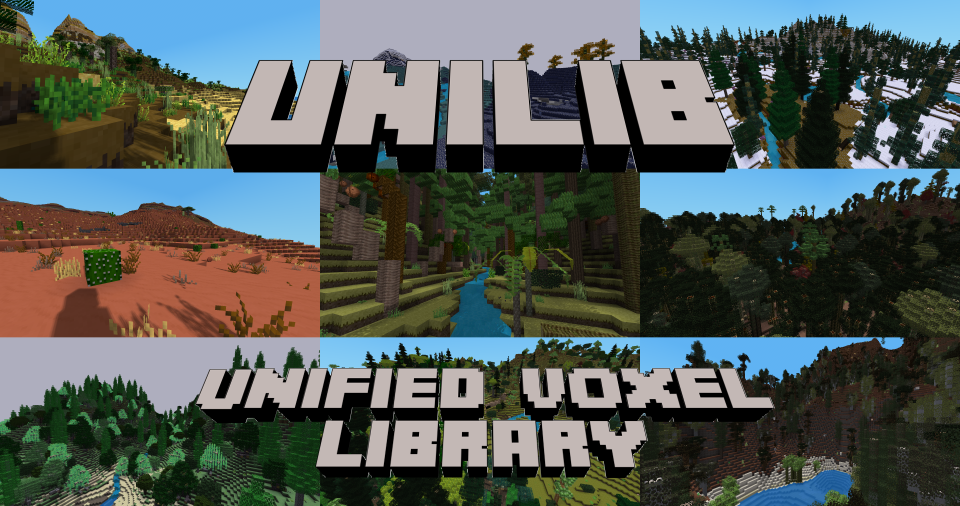

# Unified Voxel Library for Minetest-compatible engines

## Want to tinker? Download unilib [here](https://github.com/axcore/unilib).

- **unilib** includes material from over 200 [Minetest](https://www.minetest.net/) mods and modpacks, reorganised as a single mod
- None of this material is loaded automatically - it's up to you to choose what you want
- Many optional features are turned **off** by default

## Want to play? Download unigame [here](https://github.com/axcore/unigame)

- **unigame** is a traditional voxel game with many beautiful biomes and lots of stuff to collect
- It includes [unilib](https://github.com/axcore/unilib), most of the core functions of [minetest_game](https://github.com/minetest/minetest_game), and much, much more besides
- Many optional features are turned **on** by default

## unilib runs with (nearly) everything

- **unilib** is intended for all Minetest-compatible engines, including [Luanti](https://www.luanti.org/)
- **unilib** has no hard dependencies; it will run in any game
- Due to the magic of aliases, **unilib** should be compatible with most mods

## Create your own game

- You can easily create the game of your dreams - no coding skills required!
- Code has been divided into the smallest possible components, called *packages*
- For example, there is one package for sand, and another providing both stone and cobblestone
- A *remix* is a list of packages
- **unilib** provides a large selection of remixes, ready for you to use
- If you can use a text editor, then you can create your own remixes!

## Tips for unigame players

- unigame is a traditional voxel game, but some features may be surprising
    - This is a BETA release, so forget about game balance - because there isn't any!
- Your first priority is to find food and water
    - You should build your first house near a water source
    - If you don't enjoy standing in puddles, then wooden buckets are easy to craft
    - With advanced cuisine enabled, you will need to vary your diet
    - Crops and vegetables are more common in forests
    - Not all grasses drop seeds
    - Not all dirts can be used for farming
    - Most fruit trees regrow their fruits, so grab as much as you can!
    - Some kelps can be dried in a furnace, and then used as food
- Different stones have different hardnesses
    - You might have to do some exploring before you can craft your first stone tools
    - Pebbles on the surface match the type of stone below the surface
    - A wooden pickaxe can't dig all kinds of stone, and is much slower than other picks
    - Some stones produce rubble, not cobblestone; rubble can't be used to make tools
    - Most of the fun stuff is in the underground "biomes", which start about 200 metres below the surface
- Torches burn out after a while
    - You should use some kind of lamp to illuminate your house
    - It's easier to see where you're going when you wield a torch
    - Cook tree trunks in a furnace to produce charcoal, from which you can craft torches
- More than one kind of bed is available
    - Wool can be crafted from cotton; cotton seeds are dropped by some grasses
- Stairs, carvings and walls exist, but are not visible in your crafting guide
    - Basic stairs and walls have traditional craft recipes
    - Other types of stairs and carvings can be made using machines
- Brand new players should type /what in the chat window
- If you want to load the mesecons or petz modpacks, see the compatibility notes in ../scripts/

## This is an BETA release

- **unilib** is fully playable, but has not been play tested
- It contains no mobs, little industrialisation and only a few magical items
- **unilib** is highly configurable (see the **Configuring unilib** section)
- Future releases should be compatible with worlds you create now (within reason)
- Minetest v5.6.0 (or later) is recommended

# 1. Remixes and packages

A **unilib** package is a file that contains [Lua code](https://www.lua.org/).

Many packages create items that appear in the world - flowers, trees, tools and so on. Other packages shape the world itself by creating biomes, decorations and ores.

A remix is a list of packages. **unilib** includes over a hundred remixes for you to try.

Many remixes are named after the mods they come from. For example **bonemeal** comes from [the mod with the same name](https://codeberg.org/tenplus1/bonemeal), and includes most of the same material. The **mtgame** remix contains most of the material from [minetest_game](https://github.com/minetest/minetest_game). Most of the time, players won't notice the difference between **unilib** and those original mods. (The imported code has been standardised, so there will always be *a few* changes.)

The most important remix is called **playme**. It is loaded automatically by **unigame** but it also available for users of **unilib**. It provides a great many trees, plants, crops, biomes, stones, metals and minerals. However, it does not provide *all* of those items - that's where you come in! You can create your own customised game by selecting your own remixes, or by creating new ones.

## 1.1 Selecting remixes

**unilib** users can choose the remixes they want in the engine's settings.

- Click the **Settings** button in the top-right corner
- On the left side, click on **Unified Voxel Library (unilib)**
- On the right side, at the top, find the box **List of remixes and packages to load**
- Type one or more remix names, e.g. **mtgame bonemeal**
- Then click the **Set** button

The **unilib** code can be modified directly, if you prefer.

- In the **unilib** folder (directory), open the file **../lib/system/global/global_override.lua**
- Scroll down to the line containing **unilib.setting.init_remix_pkg_set**
- Uncomment the line by removing the first two hyphen characters
- Remove the word **nothing** and replace it with the names of the remixes you want, e.g. **mtgame bonemeal**
- Don't forget to preserve the double quotes, for example:

        unilib.setting.init_remix_pkg_set = "mtgame bonemeal"

## 1.2 Replacing original items

**unilib** has been designed to work well with other games, modpacks and mods.

For example, the **mtgame** remix can be used *instead of* [minetest_game](https://github.com/minetest/minetest_game), but it can also be used *in addition* to it! In this case, **unilib** will remove the original flowers, trees and tools, replacing them with its own versions of those items.

The **bonemeal** remix behaves in a different way. If you have also loaded the [bonemeal](https://codeberg.org/tenplus1/bonemeal) mod, its items are *not* replaced. In fact, this is the general rule; by default, only items imported from [minetest_game](https://github.com/minetest/minetest_game) are replaced.

This behaviour can be changed, if necessary. You can edit the **../csv/mods/imported.csv** file to change the behaviour for each original mod. Alternatively, you can tell **unilib** to replace all original items from all other mods (by enabling the setting **Force replacement of items from original mods**).

## 1.3 Updating craft recipes

Popular mods like [mesecons](https://github.com/minetest-mods/mesecons) use ingredients from [minetest_game](https://github.com/minetest/minetest_game) in their craft recipes.

These craft recipes should still work, regardless of whether the original ingredients are availabe, or whether they have been replaced by unilib versions. (Please [report](https://github.com/axcore/unilib/issues) any problems you find.)

## 1.4 World-building remixes

We have already mentioned the **playme** remix, which creates a complete world full of interesting biomes.

The **gaia** and **hades** remixes are the principle components of **playme**. Briefly, **gaia** creates biomes above the surface as well as a large number of ecosystems (a special type of "biome-within-a-biome"). **hades** creates "biomes" beneath the surface, full of useful ores for you to collect.

The **mtgame** remix contains nearly everything from [minetest_game](https://github.com/minetest/minetest_game), including its biomes, decorations and ores. If you don't want those things, you can use the **mtgame_mini** remix, which contains nearly everything *except* the biomes, decorations and ores. Those things are themselves available in their own remixes, **mtgame_biomes**, **mtgame_decos** and **mtgame_ores**. The **default** remix contains nearly everything from [minetest_game](https://github.com/minetest/minetest_game)'s **default** mod.

The following remixes each provide their own collections of biomes, decorations and ores. They should be used together with the **mtgame_mini** remix.

- **ethereal** provides everything from the [ethereal-ng](https://notabug.org/tenplus1/ethereal) mod
- **australia** provides everything from the [australia](https://content.minetest.net/packages/demon_boy/australia/) mod
- **aotearoa** provides everything from the New Zealand-themed mod, [aotearoa](https://content.minetest.net/packages/Eris/aotearoa/)

If you want items from those mods, but without the biomes, decorations and ores, then the remixes **ethereal_mini**, **australia_mini** and **aotearoa_mini** are available.

**unilib** provides a number of remixes corresponding to the mods called (at one time or another) [GAL](https://github.com/ShadMOrdre/GAL_Game). [lib_ecology](https://github.com/ShadMOrdre/lib_ecology) and [lib_materials](https://github.com/ShadMOrdre/lib_materials). These are collectively described as **GLEM**. Again, they should be used together with the **mtgame_remix** (but not with each other).

- **glemr4** is revision 4 (uploaded 12 December 2018)
- **glemr6** is revision 6 (uploaded 19th Apr 2019)
- **glemr11** is revision 11 (uploaded 31st Aug 2019)

## 1.5 Special remixes

There are a couple of special remixes that most players will want to add, at one time or another.

The **standard** remix provides a basic selection of [ABMs and LBMs](https://rubenwardy.com/minetest_modding_book/en/map/timers.html). They are used, for example, to make crops grow and to make turf spread from one dirt node to its neighbours. (**unilib** uses the term "turf" for grass that covers dirt nodes, and "grass" for plants that grow on top of dirt blocks.)

If you have not added the original [minetest_game](https://github.com/minetest/minetest_game) to your world, you should definitely add the **standard** remix.

The **chat** remix provides all of unilib's chat commands. Some of these commands require special privileges (see the section below). The **chat_normal** remix includes only commands that are available to all players.

This **standard** remix is included in **playme**, but the **chat** remixes are not.

## 1.6 Other remixes

Some other useful remixes include:

- **armour** provides not just the [3d_armor](https://github.com/minetest-mods/3d_armor) modpack, but material from a number of related mods
- **atomic** provides a way to convert unwanted items into their raw elemental components. At the moment, the system is somewhat simplistic; it will be probably be expanded in future releases
- **basic_materials** is adapted from the [Basic Materials and Items](https://content.minetest.net/packages/mt-mods/basic_materials/) mod, which provides the raw components used by mods such as [technic](https://github.com/minetest-mods/technic)
- **bonemeal** is from the [bonemeal](https://notabug.org/tenplus1/bonemeal) mod, which should work with all **unilib** trees, plants, grasses, crops, produce and flowers
- **carvings** provides items from three useful mods, [columnia](https://github.com/mt-historical/columnia), [facade](https://github.com/TumeniNodes/facade) and [mymillwork](https://github.com/minetest-mods/mymillwork). Items can carved regardless of whether this remix is loaded (as long as the optional settings have been enabled; see below)
- **empty** is a remix with no packages, used for testing
- **farming_redo** is from the [Farming Redo](https://content.minetest.net/packages/TenPlus1/farming/) mod, which provides a selection of crops and vegetables. Remixes from other farming mods like [cropocalypse](https://content.minetest.net/packages/Tarruvi/cropocalypse/) and [cucina vegana](https://github.com/acmgit/cucina_vegana) are also available
- **highlights** provides a number of items that are unique to unilib
- **minimal** provides the bare minimum number of materials (stone and water) to create a new world
- **misc** provides items from several mods, with each mod contributing only a few packages (not enough to justify creating a new remix for each one)
- **technic** is from the [technic](https://github.com/minetest-mods/technic) modpack, which provides only the raw materials from that modpack. If you want industrialisation in your world, you should load the [technic](https://github.com/minetest-mods/technic) modpack itself
- **towercrane** from the [Tower Crane](https://github.com/minetest-mods/towercrane) mod, which provides a selection of cranes giving you the ability to fly within a small area
- **underch** from the [Underground Challenge](https://gitlab.com/h2mm/underch) mod, providing 62 underground biomes (not the same ones provided by the **hades** remix!)
- **unilib** is a handy list of packages that are original to this mod. It is not really suitable for actual gameplay

## 1.7 Advanced remix selection

As well as remixes, you can specify individual packages to load.

For example, the package called **test_node** creates a node that can't be crafted (but is visible in the player's crafting guide). When added to the list of remixes, it must be preceded by the special character **+**.

In the **List of remixes and packages to load** setting, type the following:

        mtgame bonemeal +test_node

Alternatively, in the **global_override.lua** file described above, change the line to this:

        unilib.setting.init_remix_pkg_set = "mtgame bonemeal +test_node"

You can use another special character, **@**, to clarify that something is a remix, not a package. This is optional, so both **bonemeal** and **@bonemeal** are acceptable. (In the remix list, package names are *always* preceded by the **+** character.)

The final special character, **!**, tells **unilib** *not* to load something. It can be used with both remix and package names:

        !mtgame !@bonemeal !+test_node

**unilib** searches for the **!** character before parsing the rest of the list, so in both of these examples, the package is *not* loaded.

        +test_node !+test_node
        !+test_node +test_node

The **!** character is *always* used before the other special characters, so **@!mtgame** and **+!test_node** will not work.

## 1.8 Pseudo-remixes

There are two "remixes" which are not real remixes at all.

**everything** is a quick way to load **all** remixes (which should load *nearly* all available packages). This does not produce a satisfying game, but it might be useful in the following situations:

- You want to browse the player's crafting guide to see all the items that **unilib** provides
- You want to check for errors and crashes, after modifying **unilib** code (or after writing your own packages)

The word **everything** can be used alone, or it can be added to the remix list, e.g. **mtgame bonemeal everything**.

The second pseudo-remix is **nothing**, which causes *no* remixes or packages to be loaded. If this word is inserted into the remix list, e.g. **mtgame bonemeal everything nothing**, it overrides *everything* else (including the **everything** remix itself!)

**everything** and **nothing** cannot be used with special characters.

Note that the order of remixes is usually not that important, but they are in fact loaded in the order you specify them (unless the list includes **everything** or **nothing**, in which case the order is ignored).

## 1.9 Technical information about remixes

A remix is defined as a folder inside unilib's **../csv/remixes/** folder (and a few other locations). The folder must contain a file called **packages.csv**.

**packages.csv** lists the packages included in the remix. If you want to change the list, you could simply open the file in a text editor. However, any changes you make *might* be overwritten when you update **unilib**. (See below for ways to get around this problem.)

The file lists packages in the following format:

        # Mushroom packages
        mushroom_brown|flowers
        mushroom_red|flowers

Lines that start with the **#** character are ignored. The **|** character is the column separator. Empty lines are ignored, but all other lines must *not* start with whitespace.

**mushroom_brown** and **mushroom_red** are the names of packages. They are followed by the names of the mods they originally come from, but that is optional; you could just as easily list only the package names.

        # Mushroom packages
        mushroom_brown
        mushroom_red

Remixes can *include other remixes*. Do this by placing the character **@** before the remix name.

        # Other remixes to include
        @armour
        @bonemeal
        @castle

(Do not try to add the other special characters such as **+** and **!**; **they only work in the remix list described above**. The pseudo-remixes **everything** and **nothing** cannot be specified here.)

Usually, the order of packages doesn't matter. There are a couple of exceptions; one of which is that "base" packages such as **base_mtgame** and **base_australia** should always be listed first. It also doesn't matter, if the same package is mentioned in several remixes (but you will see a warning, if you list the same package more than once in the same remix).

**unilib's** built-in remixes contain, at the end of the **packages.csv** file, a list of package dependencies. This list is **optional** and **intended only for the convenience of remix writers**; when you start writing your own remixes, there is no need to list all the dependencies. Package dependencies are described in the next section.

Some remixes contain other files, besides **packages.csv**. These additional files are ignored until some part of the code (usually a specific package) wants to read them. In many cases, the additional files can be edited by you, the player (but you'll have to read the package code first, so you can understand what it is you're editing.)

## 1.10 Technical information about packages

A package is defined as a **.lua** file inside **unilib**'s **../lib/packages/** folder (and a few other locations). The file is executed as [Lua](https://www.lua.org/) code.

Future releases will include more detailed information about packages, including how to write new ones. For now we'll provide a brief summary.

Packages typically include three [Lua](https://www.lua.org/) functions, **.init()**, **.exec()** and **.post()**.

The **.init()** function is compulsory. It returns a table of data describing the package and its requirements. (On extremely rare occasions it might execute some code of its own.)

The **.exec()** function is optional. It contains the bulk of the code to be executed.

The **.post()** function is also optional. It contains any code that must be executed, *after* every package's **.exec()** function has been called.

For example, the **.exec()** function is used to define both liquids and empty buckets. We don't know how many types of bucket, or how many types of liquid, will exist until every **.exec()** function has been called. Therefore, the code to produce buckets full of liquid is found in the **.post()** function.

Packages can depend on other packages, and even on other mods. Some packages won't run unless some other package (or mod) has already been loaded. Some packages will still run, but will have reduced capabilities.

Information about these dependencies is included in the data returned by the **.init()** function. There are four ways in which a package can depend on other packages:

- **depends** - package A will not run without package B
- **at_least_one** - package A will not run, unless at least one of the packages B, C and D is loaded
- **optional** - package A has some extra functionality, if any of packages B, C and D are loaded
- **suggested** - when craft recipes require a *type* of ingredient instead of a specific ingredient (for example any kind of sugar), then package A will *suggest* a package B which provides that ingredient. Package writers are free to suggest any package providing a suitable ingredient (or even rely on a different mod to provide it)

The same four classes of dependence also apply to other mods; in the table of data returned by the **.init()** function, they are called **mod_depends**, **mod_at_least_one**, **mod_optional** and **mod_suggested**.

Dependencies affect the order in which packages are executed. Specifically:

- The **.init()** function of all packages is called first, in the order specified by the remix
- The **.exec()** function of all packages is called next; the order may be different, because if package A depends on package B, then package B is called first
- The **.post()** function of all packages is called last, in the order specified by the remix

## 1.11 Packages providing biomes, decorations and ores

Packages providing biomes, decorations and ores are named accordingly. Usually the package name includes the name of the original mod (because, for example, more than one mod creates a biome called **grassland**):

        biome_default_grassland
        deco_australia_grass_dry
        ore_ethereal_clay_baked

If you want to write a new remix with its own unique collection of biomes, decorations and ores, then there are a few things to consider.

Firstly, nearly all of these packages will depend on other packages. The biome package in the example above requires all of the following packages:

        dirt_ordinary
        liquid_lava_ordinary
        liquid_lava_ordinary
        sand_ordinary
        stone_ordinary

The decoration package has over a dozen optional dependencies, but just a single hard dependency:

        grass_dry

You can save a bit of time by asking **unilib** to give you a list of all package dependencies that you haven't yet added to your remix. (Enable this behaviour using settings and/or chat commands.)

An interesting feature of **unilib** decorations is that they tend to be split into two parts. This makes it much easier to re-use an existing decoration in a new context.

Let's take the **deco_australia_grass_dry** package for an example. The first half of the decoration's definition is found in the **grass_dry** package itself, and includes the things that don't change: the name of the grass, how densely it occurs, and so on.

The second half is found in the **deco_australia_grass_dry** package, and includes the things that *do* change often: the name of the biome, the height range, and so on.

Because of this feature, it is quite simple to make the grass spawn in other places: just create a new package, modelled on **deco_australia_grass_dry**, but specifying different biomes and/or heights. There is no need to duplicate the first half of the definition (the one found in **grass_dry**); that semi-definition is available for any other package to use.

It's also possible to create biomes, decorations and ores using a spreadsheet (i.e. a **.csv** file). You can see the **gaia** remix for a comprehensive example.

That should give you an idea of what is possible; full instructions about how to create or modify packages, and how to design new biomes, decorations and ores, will appear in a later release.

# 2 Creating new remixes

There are three ways to create your own remixes: two "wrong" ways and a "right" way.

The "wrong" ways are wrong, because any changes you make to **unilib** may be lost as soon as you download a new release. The "right" way involves creating your own **expansion pack** that you yourself control.

Both of the "wrong" ways are fine for testing, and they're also fine if you are careful about replacing an older version of **unilib** with a newer one. Nevertheless, if you create something worth preserving, consider preserving it using the "right" way!

## 2.1 Method 1: Add a new remix to the /csv folder

To create a new remix:

- Open the folder **../csv/remixes/**
- Inside that folder, create a new folder, perhaps named **myremix**
- Inside the new folder, create an empty file called **packages.csv**

That's it! **unilib** will not complain that the remix is empty, but let's add some packages anyway.

- Open the new **packages.csv** file in a suitable text editor
- Add the following lines:

        food_bread_pitta
        food_bread_wholegrain_carrot
        ingredient_dough_pitta
        ingredient_dough_wholegrain_carrot

These packages have been adapted from the [bread](https://codeberg.org/Lahusen/bread) mod. After adding **myremix** to your remix list (as described above), you can create a new world and start playing!

## 2.2 Method 2: Add a new remix to the /custom folder

The problem with the first method is that some future **unilib** release might contain its own remix called **myremix**, which would overwrite yours.

Instead, you can use the **../custom/** folder. No future release will add any new remixes or packages to this folder. (There is still a risk that the *entire* **unilib** folder will be deleted during an update, of course.)

To add a remix here, create a new folder called **myremix** inside the **../custom/remixes/** folder, and repeat the process above.

## 2.3 Method 3: Create an expansion pack

Expansion packs are separate mods that provide new remixes and packages.

At the moment, there is only one "official" expansion pack called [unitest](https://github.com/axcore/unilib). It provides a single test node, but no remixes of its own.

You can use this mod as the basis for your own customised expansion pack.

- Download the expansion pack (mod) to the usual location
- Rename the pack's folder from **unitest** to (for example) **mypack**
- Edit the mod's **mod.conf** file to change its name to **mypack**
- In **unilib**'s own **mod.conf** file, add **mypack** as a dependency

Now you can continue as above, creating a new folder call **myremix** in **mypack**'s own **../csv/remixes/** folder.

# 3 Chat commands

**unilib** provides a large number of chat commands. A few of them are used to tweak the player experience, but most are used to assist developers of new remixes and packages.

All **unilib** chat commands are created by packages. For example, the **/list_nodes** command is created by the **chat_list_nodes** package. To load all **unilib** chat commands, add the **chat** remix.

Not all **unilib** chat commands are available to all players. In particular, if you are running a server, you will have to consider which commands should be made available to which players.

In order to have access to *all* commands, you must grant yourself the following privileges:

        /grantme unilib_tools
        /grantme unilib_admin
        /grantme unilib_danger

The **unilib_tools** privilege enables commands which *might* be suitable for all players on a server, or might *not*. For example, it enables the **/list_trees** command; if you don't want your players to know about every single **unilib** tree in the game, then don't grant them this privilege (or else don't load the **chat_list_trees** package in the first place).

The **unilib_admin** privilege enables commands which are definitely only suitable for use by server administrators (or possibly suitable for you in your single-player worlds). For example, it enables the **/reset_health** command (which increases a player's health to the maximum).

You should not grant yourself the  **unilib_danger** privilege unless you're sure that you need it. It enables the **/cut_trench** command to cut a series of deep trenches into your world, destroying anything in its path.

A complete description of chat commands will appear in a future release; a few of them are described below. In the meantime, you can get a list of commands by opening the engine's chat window and then typing **/help**. (The **packages.csv** file in the **chat** remix also contains a brief summary of each **unilib** chat command and its usage.)

## 3.1 Daily alarms

The following commands don't require any special privileges.

        /set_alarm <time>

Sets an alarm which goes off every game day, until cancelled. The alarm is visible in the chat window and is audible (if your volume is not muted). Only you can see and hear your own alarm.

<time\> is a 24-hour clock time in the form HH:MM, for example 13:30 for half-past one in the afternoon. Quarter-past seven in the morning can be expressed as either 07:15 or 7:15.

To get the current game time, use the engine's own chat command **/time**.

        /cancel_alarm

Cancels the daily alarm you have set, if any.

        /show_alarm

Shows the daily alarm you have set, if any.

## 3.2 Finding biomes

The following commands require the **unilib_admin** or **unilib_tool** privileges.

        /show_biome

Displays the biome at your character's location. Use this command to toggle the display on and off.

        /find_biome <biome>
        /find_biome

Attemps to teleport your character to the specified biome. <biome\> can be the full name of the biome, for example **default_grassland**. It can also be a partial name like **grassland**; **unilib** will teleport you to the closest matching biome. (You can use the **/list_biomes** command to get a list of available biomes.)

This command is useful, but is not a universal panacea. You may find yourself teleported to a location in which the desired biome exists for just a few blocks. Sometimes the specified biome can't be found at all.

**unilib** remembers which biome you are trying to find, so you don't need to type the biome name the second time.

        /switch_biome

Attempts to teleport your character to different biomes in a repeating cycle. You might be able to visit every possible biome just by typing this command repeatedly (subject to the limitation described above).

## 3.3 Player statistics

The following commands don't require any special privileges.

**unilib** collects statistics about the player's in-game activities. These records are commonly used by [awards](https://gitlab.com/rubenwardy/awards) mods, but are also available to satisfy your own curiosity. (**unilib** currently contains no awards.)

Collection is turned on by default, but can be turned off in settings. (There are two collections of data, biographical statistics, and activity statistics; so there are two settings to disable.)

To see your statistics, type this:

        /show_statistics

You can see more information about how your character has died:

        /show_death

You can also see more about the items you have dug, placed, crafted or eaten:

        /show_dig
        /show_place
        /show_craft
        /show_eat

## 3.4 Player effects

The following commands don't require any special privileges.

**Player effects** are features of the player experience. For example, when you dig a block of dirt, does it magically appear in your inventory (as in [Minetest](https://minetest.org/)), or does it drop to the floor (as in [Minecraft](https://www.minecraft.net/))?

Player effects can be enabled or disabled in settings. (See the section below for a longer list of them.)

Assuming that they have been enabled generally, a few effects can be toggled on a per-player basis using chat commands. For example, you can change what happens when you dig a block:

        /toggle_autodrop

You can also change what happens when you stand near a block that has been dropped on the floor:

        /toggle_autoget

You can see more information about the node directly in front of you. All of the following commands have the same effect:

        /toggle_identify
        /identify
        /what

Finally, you can change the size of your hotbar:

        /set_hotbar <size>

<size\> should be a value in the range 1 to 32. To reset the size of your hotbar, omit the <size\> altogether.

# 4 Configuring unilib

**unilib** is highly configurable. Besides choosing the packages you want, there are a large number of settings which significantly affect the player experience. They can all be configured in the engine's settings menu, as described above.

A full description of **unilib** settings will be added in a future release. In the meantime, here is a selection of the most useful ones.

## 4.1 Cuttings

**Cuttings** are ordinary blocks that have been re-shaped, sometimes in the player's own crafting grid, but sometimes by using a special machine.

There are three types of cuttings. **stairs** have blocky shapes and **carvings** have more refined shapes. **walls** tend to have a single shape that most players will recognise.

Several [Minetest mods](https://content.luanti.org/) provide stairs (for example [stairs_redo](https://notabug.org/tenplus1/stairs), [stairsplus](https://github.com/CasimirKaPazi/stairsplus), [moreblocks](https://github.com/minetest-mods/moreblocks/), [plantlife](https://github.com/mt-mods/plantlife_modpack), [castle](https://github.com/minetest-mods/castle/), [pkarcs](https://github.com/TumeniNodes/pkarcs|)), and other mods provide carvings (for example [columnia](https://github.com/Glunggi/columnia), [facade](https://github.com/TumeniNodes/facade), [mymillwork](https://github.com/minetest-mods/mymillwork)).

All of those mods have been imported into **unilib**. The good news is that they're available for use with a greater variety of blocks than the original mods allowed. The bad news is that the total number of stairs and carvings **greatly exceeds** the [Minetest](https://www.minetest.org/) limit (about 32000 unique items), so you will have to pick and choose which stairs and carvings you want in your world.

By default, only a basic set of stairs and carvings are available. Change the engine's settings to enable additional sets, for example:

        Enable stairs from moreblocks
        Enable facade carvings

By default, *no* stairs and carvings are visible in the player's crafting guide. Change the engine's settings to make them visible, for example:

        Show basic stairs in creative inventory
        Show facade carvings in creative inventory

The crafting recipes for the most basic stairs will be familiar to most players, but in case you don't want to carry a hundred different recipes around in your head, there is a shortcut: use one of **unilib**'s cutting machines.

For example, the circular saw (provided by the package **machine_saw_circular**, in the remix **moreblocks**) comes in four versions. The Mark I machine creates basic stairs, the Mark II machine creates stairs from the **stairs_redo** mod, and so on.

The carving machine (provided by the package **machine_carving**, in the remix **carvings**) provides carvings from the **facade** mod, and the millwork machine (provided by the package **machine_milling**, in the remix **carvings**) provides carvings from the **mymillwork** mod.

## 4.2 Super stones and super trees

Stone and tree nodes (including trunks and branches) can be used to craft a variety of items. Because **unilib** provides such a great variety of stones and trees, there is again a risk of breaching [Minetest](https://www.minetest.org/)'s ~32000 item limit.

A workaround for this problem is to specify a list of **super stones** and **super trees**.

**unilib** will create lots of items crafted from super stones and super trees, but fewer items crafted from normal stones and trees. To take an obvious example, only basic stairs can typically be crafted from normal stone and tree nodes, but the full range of stairs can be crafted from super stone and super tree nodes.

Many other items, besides just stairs and carvings, are available (or not) depending on which stones and trees you have designated as "super" stones and trees.

By default, the range of super trees are those derived from [minetest_game](https://github.com/minetest/minetest_game): the apple (default) tree, aspen tree, pine tree, jungle tree and acacia tree. The super stones are also from [minetest_game](https://github.com/minetest/minetest_game): the default grey stone (called "ordinary" stone in **unilib**), and desert stone.

You can designate any number of stones and trees as "super" stones and trees. A good approach is just to designate one or two things at a time, as you need them. For example, in settings you could change **Super tree types can craft anything** to this:

        acacia aspen apple jungle pine banana orange healing frost redwood

...which will designate a selection of trees derived from [ethereal-ng](https://codeberg.org/tenplus1/ethereal).

As with remixes, the words **everything** and **nothing** can be specified, though if you specify **everything** you may be disappointed when [Minetest](https://www.minetest.org/) informs you that you've reached the item limit. **everything** overrides any tree types in the list, and **nothing** overrides everything else, include **everything** itself.

## 4.3 Super dirts

There is a third category of "super" items, **super dirts**. They behave exactly like super trees and super stones: more items can be crafted from them, and the list of super dirts can include the words **everything** or **nothing**.

The **gaia** and **playme** remixes use a number of different dirts, but that isn't generally the case for other remixes. For that reason, it's usually not worth adding more dirts to your super dirt list.

(By the way, **unigame** players already have an expanded list of super dirts.)

## 4.4 Other dirt settings

Speaking of dirts, you can change the appearance of (most) dirts, so that only turf is visible on the sides of dirt blocks.

To change the appearance of dirt, change the following setting:

        Only turf visible on sides of dirt-with-turf nodes

Some remixes (**gaia** and **playme**, especially) create many hundreds of dirt-with-turf nodes. If you don't particularly want to see them all in your crafting guide, change the following setting:

        Show covered dirt in creative inventory

## 4.5 Squeezed items

All players eventually experience storage problems: how do you store a million cobbleblocks, if your charming rustic house is hardly big enough to swing a cat?

**unilib** allows you to "squeeze" many common items. For example, nine stone blocks can be squeezed to create a single compressed block; nine compressed blocks can be squeezed to create a single condensed block.

Various types of items can squeezed: stone, gravel, dirt, sand, metal and leaves. Each type has its own setting. For example, to allow squeezed leaves block, change the following setting:

        Leaves can be compacted

If you want a maximum of 999 squeezed blocks in each stack, rather than usual maximum of 99, change the following setting:

        Compressed/compacted/condensed blocks have stacks of 999

Squeezed items are normally created in the player's crafting grid. If the [technic](https://github.com/minetest-mods/technic) modpack is loaded, technic machines must be used instead.

## 4.6 Dyes

If you have an exaggerated need for dyes, you can obtain them from crops and fruit (as well from flowers, as normal).

This behaviour is unrealistic, so is disabled by default. To enable it, change the following settings:

        Craft dyes from crops
        Craft dyes from fruit
        Craft dyes from produce

By the way, in **unilib** terminology, **produce** is a crop that can be grown without seeds (usually by planting the harvested item itself, such as a salad tomato).

## 4.7 Individual mod settings

A number of **unilib** settings affect only items from one original mod. There are too many to list here, so we just mention of few of them.

Much of the material imported from [minetest_game](https://github.com/minetest/minetest_game) has been tweaked quite a lot; you can disable many of those tweaks by changing the following setting:

        Allow tweaks to code adapted from minetest_game

If the [advanced trains](https://git.bananach.space/advtrains.git) (advtrains) mod has been loaded, **unilib** will create train platforms out of many different stone types. To disable that behaviour, change the following setting:

        Create advtrains platforms from unilib stones

By default, suitable flowers can be planted in flowerpots. If you want to plant other living things in flowerpots, change the follow settings:

        Add all suitable mushrooms to compatible flowerpots
        Add all suitable plants to compatible flowerpots
        Add all suitable saplings to compatible flowerpots

**unilib** torches burn out after a while. You can set how long an ordinary torch will last (in seconds) by changing the following settings:

        Minimum burn time for ordinary torches
        Maximum burn time for ordinary torches

## 4.8 Tool settings

The [toolranks](https://github.com/lisacvuk/minetest-toolranks) mod, which has been imported into **unilib**, improves the performance of your tools, the more you use them. To enable this behaviour, change the following setting:

        Enable toolranks

Damaged tools can be repaired with a hammer and an anvil. Most anvil mods allow a tool to be repaired limitless times; **unilib** implements a more realistic system, in which a tool eventually wears out completely. To enable it, increase the value of the following setting:

        Limit tool repair over time

Use a value of 0.1 to make a tool repairable 100 times, or a value of 0.01 to make it repairable 1000 times.

## 4.8 Wielded light settings

When your character is walking around the world, you can use an item like a torch or a lamp to light the way. To enable this behaviour, change the following setting:

        Bright items illuminate player's surroundings

## 4.9 Auto-get and auto-drop

As described above, you enable [Minecraft](https://www.minecraft.net/)-style handling of dropped items by changing the following settings:

        Pick up nearby items automatically
        Drop items automatically on dig

## 4.10 Hunger and thirst

By default, simple hunger is enabled, but thirst (hydration) is not enabled.

You can enable advanced cuisine, which rewards players who have a varied diet. (This is not a realistic system; a chocolate cake counts as something completely different to a banana cake.)

You can also enable thirst, if you want it. Assuming that the **thirst** remix has been added, then specialist items will be available in your crafting guide; you can use them if you prefer to drink like a civilised human being, rather than from a hole in the ground.

Change the following settings:

        Advanced eating/drinking
        Enable hydration/thirst

# 5 Notable features

There are over 100 different remixes, and well over 4000 packages. Here are some suggestions for things worth adding to your game.

Many of these suggestions are unique to **unilib**. Most of them have already been added to the **playme** and **highlights** remixes and, of course, you can test any of them by adding the **everything** remix.

## 5.1 Calendars

(Packages **misc_calendar_simple** and **misc_calendar_fancy**, in the **unilib** remix)

(Packages **chat_add_event** and **chat_delete_event**, in the **chat** remix)

**unilib** keeps track of the passage of time. If you craft a simple calendar and then right-click it, the date will be visible. Right-clicking a fancy calendar opens it up for your inspection.

If your character has had an eventful life, some of those events will be visible in the calendar; you can add more using the **/add_event** command.

        /event Today I ate some chocolate cake.

The **/delete_event** command will remove the same event, but it can't be used to remove evidence of your birthdays, your deaths and so on.

The calendar starts on 1st January in the year 1000. This date can be changed in settings. If you're willing to get your hands dirty with some [Lua](https://www.lua.org/) code, then the calendar format is customisable (by creating your own weekdays and months, and by specifying weeks, months and years of any length).

## 5.2 Flags

(**offend_flags** remix)

There's nothing like a nice flag to mark the territory you've claimed as your own. Other Minetest mods provide flags, but only **unilib** provides a convenient flag-printing machine so you don't have to click-click-click to find the flag you want.

To use the machine you'll need some red, green and blue cartridges, as well as some blank flags.

New flags can be added to **unilib** quite easily. First, copy the image files into **unilib**'s **/textures** folder. Then, open the **../csv/remixes/offend_flags/flags.csv** file in a suitable text editor.

In that file, add one new line for every new flag. For example, to add the flag of Japan you would add this line:

        japan||Japan

There are actually three columns: on the left, the flag's "name" and on the right, a description. The middle column is usually left blank; there is no need to specify the texture's filename if it's the same as the flag name.

## 5.3 Distance and surveyor's meters

(Several packages in the **misc** remix)

These laser meters are used to measure distances; they're especially useful for large building projects. Six meters, of varying maximum lengths, are available.

Distance meters are simple. Place a block at one end of the distance you want to measure; at the other end, place the meter and right-click to turn it on. Let your mouse hover over the meter in order to see the distance between it and the placed block.

Surveyor's meters are a little more complex. Place one on the ground, and then right-click it to open a form. Using the form you can turn the meter on or off, or set the mid point and section markers.

## 5.4 Node replacers

(Packages **item_replacer_normal** and **item_replacer_artisanal**, in the **misc** remix)

**unilib** offers two node replacement tools. The "normal" replacer (from the [replacer](https://github.com/Sokomine/replacer) mod) will already be familiar to many users. When used to punch a block, that block is replaced with a single type of thing (until the player runs out, or until the replacer is reset).

The "artisanal" replacer, on the other hand, replaces punched blocks with a selection of different things, choosing one at random each time. It's often used to create realistic-looking paths and walls.

To set up the artisanal replacer, wield it and then right-click.

Drag one or more nodes from your inventory into the grid at the top of the form. This grid represents the probability of each type of thing being placed. If you drag one smooth stone and one cobblestone into the grid, they each have an equal chance of being placed, every time the tool is used. If you drag three smooth stones and only one cobblestone into the grid, then there's only a 25% chance that the cobblestone will be placed each time.

When the form is open, you can switch between placing a node next to the one you've clicked, or else replacing the node you've clicked. (This is a bit different to the "normal" tool, which uses left- and right-clicks respectively for those purposes.)

## 5.5 Castle shields

(Packages **misc_shield_mounted_basic**, **misc_shield_mounted_british** and **misc_shield_mounted_extra**, in the **castle** remix)

The [castle shields](https://github.com/minetest-mods/castle_shields) mod provides three decorative shields to be hung on your castle walls. **unilib** provides a much larger selection.

The **misc_shield_mounted_british** package provides shields with various traditional British themes, and the **misc_shield_mounted_extra** package provides a complete set of shields in various designs and colours.

## 5.6 Paintings and portraits

(Packages **misc_painting_small**, **misc_painting_portrait** and **misc_painting_landscape** in the xdecor remix)

**unilib** provides a selection of famous paintings and portraits, about sixty of them in total.

If you search for "painting" in your crafting guide, you'll find just three items marked S, L and P. When placed in the world, they will transform into a random (S)mall painting, (L)arge painting or (P)ortrait. If you don't like what you see, just place the item again to get a different image.

The resolution of the paintings has been drastically reduced so that the images are a reasonable size. This should fit well with **unilib**'s blocky aesthetic; if you find that you want more realistic images, then you are free to replace the blocky images in the **../textures/** folder with high-resolution alternatives.

## 5.7 Chests

(Packages **container_chest_compact** and **container_chest_bottomless**, in the **misc** remix)

As an alternative solution to the storage problems mentioned above, **unilib** provides a "bottomless" chest. Its size is initially limited to 60 stacks, but you can click the buttons to add extra "pages", each one providing room for another 60 stacks.

At the other end of the scale is **unilib**'s own "compact" chest which has a capacity of just 6 stacks. This might useful in some kind of quest scenario, in which the player's ability to store things needs to be restricted. (If you're willing to tweak the package code, you can change the capacity of the compact chest.)

## 5.8 Atomic machines

(**atomic** remix)

**unilib** provides a way to convert unwanted items into their raw elemental components. At the moment, the system is somewhat simplistic; it will be probably be expanded in future releases.

You can start by placing items into the **vapouriser**. This machine should be connected to a **collector** using **atomic tubes**, placed in a straight line.

The output is randomised; you should get different results every time you place a node in the vapouriser. However, these fluctuations will average out over time. The ideal tube length is 20; any shorter (or longer!) than that will result in reduced output.

The output produced for every input item is specified by files in the **../csv/remixes/atomic/** folder. You can tweak them to satisfy your own requirements, if necessary.

**unilib** packages exist for every element in the [Periodic Table](https://en.wikipedia.org/wiki/Periodic_table). Although all of the elements exist, some of them can't be obtained through normal gameplay, not even using the (unmodified) vapouriser and collector. Nevertheless, they're available for anyone who wants to use them in their own original mods, remixes or packages.

## 5.9 Other machines

(Various packages in the **highlights** remix)

The induction furnace (**machine_furnace_induction** package) melts compatible metal blocks and ingots. A few mineral blocks (such as mese) can also be converted into a molten form. The induction furnace requires much more fuel than an ordinary furnace, and takes a minute to produce a single bucket of molten material.

The gem-polishing machine (**machine_polishing** package) polishes compatible mineral lumps to produce gems. Typically, mineral packages will create gems only when this package is loaded. In a few cases (such as diamonds from [minetest_game](https://github.com/minetest/minetest_game)), ores will drop lumps instead of the usual pristine crystals; the lumps can then be polished using the machine. To place a limit on the number of "precious" gems a player can produce, the machine consumes a single mese block (or nine mese crystals) to polish a single gem, taking 45 seconds to do so.

The renovation machine (**machine_renovation** package) converts items from other mods into their unilib equivalents, at no cost to the player. In the future, it will also convert obsolete **unilib** items into their newer equivalents. Right-click the machine to open a form, which can also be used to identify any "unknown" items. The machine removes any metadata from the renovated item, so it should be used with care.

The enlightening table (**machine_table_enlightening** package) uses mese crystals to convert compatible tools into glowing versions of themselves. Each enlightenment costs up to three crystals. Placing up to 15 lava sources around the table increases the magnitude of the glow. Unlike an enchanting table, no air gap is required, and the lava can be placed at the same horizontal level as the enlightening table, or just below it. The enlightening table is compatible with all unilib axes, chainsaws, drills, hoes, pickaxes, scythes, shovels, sickles, spears and swords (but not usually with tools from other mods).

The turfing machine (**machine_turfing** package) is used to grow different turfs on different types of dirt. It's intended for use in worlds where other methods of obtaining a specific dirt-with-turf combination (such as the crystallite shovel from [ethereal-ng](https://notabug.org/tenplus1/ethereal)) are not available. To use the machine, place it on top of a dirt-with-turf node; that is the type of turf that will be grown. If you place the machine on some other type of node, then you must place a dirt-with-turf node in the machine's slot manually.

**unilib** provides two sounding lines (from the **misc_line_sounding_normal** and **misc_line_sounding_reinforced** packages). They are used to measure the depths of holes and caves. The "reinforced" line will work in water or lava, whereas the "normal" line will not.

# 6 Known issues

## 6.1 Serious issues

- **mapgen_hades_jit** package: enabling all optional flags (in the package code) causes instability (i.e. crashes)
- **mapgen_hades**, **mapgen_hades_jit**, **underch_jit** packages: ore blobs are all placed at the same locations, and at regular intervals, rather than at fully random locations

## 6.2 Minor issues

- **material_flax_roasted** package: cannot yet use all types of stone in its craft recipes, due to engine limitations
- **deco_snow_flower_frozen**, **deco_snow_plant_shrub_frozen** packages: the flowers cannot yet be spawned in place of ordinary snow, due to engine limitations
- The wielded light effect does not work underwater, either in unilib or in the original mod's code
- **misc_butterfly** package: butterflies do not spawn at the same rate as they do in minetest_game for unknown reasons (but fireflies behave as expected)
- Expansion packs such as [unitest](https://github.com/axcore/unilib) generate warnings in Minetest's debug.txt file; I haven't found a workaround for it yet

# 7 Credits

- Author: A S Lewis
- Source: [Github](https://github.com/axcore/unilib)
- Licence (original code): GNU Lesser General Public License, version 2.1 (LGPLv2.1)
- Licence (original media): Attribution-ShareAlike 3.0 Unported (CC BY-SA 3.0)
- Licence (imported code and media): see the ../licences/ folder

All code and media that has been imported from other games, modpacks and mods has been credited to their authors, and is subject to original licences.

For code, the source is credited inside the code itself. For a comprehensive list of imported games and mods, their authors and the licences that apply to them, see the file **../csv/mods/source.csv**.

The **../archive** folder contains original code and media, sorted into folders identifying the original game or mod. You can use this to discover what the source was, and therefore which licence applies to it. Some folder names include the word **DONE**; these folders contain media that has been modified in some way. The modifications are described in each folder's **CREDITS** file

For models, schematics and audio files, there is a single **CREDITS** file, which can be found in the **../models/**, **../mts/** and **../sounds/** folders.
